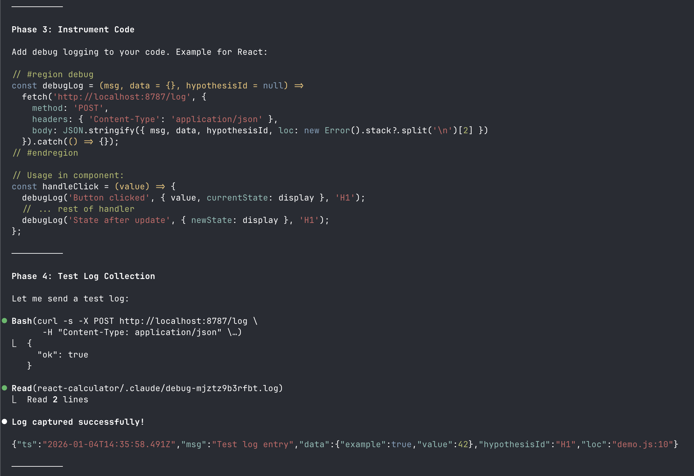

# Debug Mode Skill

Ported [Cursor's Debug Mode](https://cursor.com/blog/debug-mode) as a skill for Claude Code, OpenCode, Codex, Cursor, and any agent that supports skills.



**How it works:**
- Start a log server on localhost
- Instrument code to send logs
- Read logs from file, fix with evidence

Runtime agnostic - works anywhere with localhost access.

## Installation

### Quick Install (recommended)

```bash
npx skills add https://github.com/vltansky/skills --skill debug-mode
```

Installs to all detected agents (Claude Code, OpenCode, Codex, Cursor, Antigravity).

**Options:**
```bash
npx skills add https://github.com/vltansky/skills --skill debug-mode -g
npx skills add https://github.com/vltansky/skills --skill debug-mode --agent claude-code
npx skills add https://github.com/vltansky/skills --skill debug-mode -g -y
```

### Manual

```bash
git clone https://github.com/vltansky/skills.git
cp -r skills/debug-mode ~/.claude/skills/debug-mode/
```

## Usage

In your AI agent, invoke the skill:

```
/debug /path/to/project
```

Or just describe a bug - the skill auto-triggers on phrases like:
- "debug this", "fix this bug", "why isn't this working"
- "investigate this issue", "trace the problem"
- "UI not updating", "state is wrong", "value is null"

## Permissions

To skip permission prompts, add to `~/.claude/settings.json`:

```json
{
    "permissions": {
      "allow": ["Skill(debug-mode:debug-mode)", "Bash(node:*)"]
    }
}
```

## Agent Compatibility

| Agent | Global Path | Project Path |
|-------|-------------|--------------|
| Claude Code | `~/.claude/skills/debug-mode/` | `.claude/skills/debug-mode/` |
| OpenCode | `~/.config/opencode/skill/debug-mode/` | `.opencode/skill/debug-mode/` |
| Codex | `~/.codex/skills/debug-mode/` | `.codex/skills/debug-mode/` |
| Cursor | `~/.cursor/skills/debug-mode/` | `.cursor/skills/debug-mode/` |
| Antigravity | `~/.gemini/antigravity/skills/debug-mode/` | `.agent/skills/debug-mode/` |

## Structure

```
debug-mode/
├── SKILL.md              # Skill instructions
└── scripts/
    ├── debug_server.js   # Log server
    └── debug_cleanup.js  # Log cleanup utility
```

## Requirements

- Node.js 18+

## License

MIT
